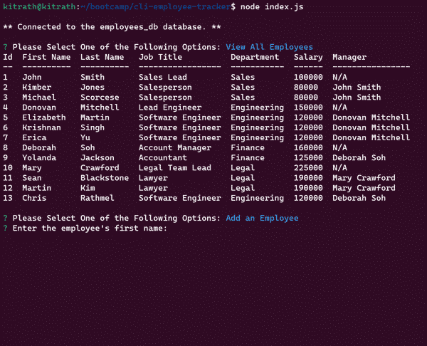

# CLI Employee Tracker

## Description
Provides a command-line interface to a simple employee database.  Users can view and create departments, roles, and employees.  Users are able to reassign employees to different roles.
The application is built with nodejs and [MySQL](https://www.mysql.com/). It uses [inquirer](https://www.npmjs.com/package/inquirer) for the command-line user interface, and [mysql2](https://github.com/sidorares/node-mysql2#readme) for interacting with the database.

**Watch a short screencast of the application: [CLI Employee Tracker Screencast](https://watch.screencastify.com/v/2ns4T7k9v1MwPH5kfiR9)**

## Installation
1. Clone this repository: `git clone git@github.com:kitrath/cli-employee-tracker`
2. Navigate to the base directory: `cd cli-employee-tracker`
3. Install dependencies: `npm install`
4. Create and (optionally) seed the database. Log in to the mysql cli client with `mysql -u <username> -p`, then `source db/schema.sql`, and finally (to seed) `source db/seeds.sql`.

## Usage
Run `node index.js` to start the application.  Select from the main menu whether you want to view or create departments, roles, or employees.  Follow the prompts for each selection.  After each selected action, you'll be presented again with the main menu.  Press `CTRL-C` at any time to exit the application.

## Screenshot

